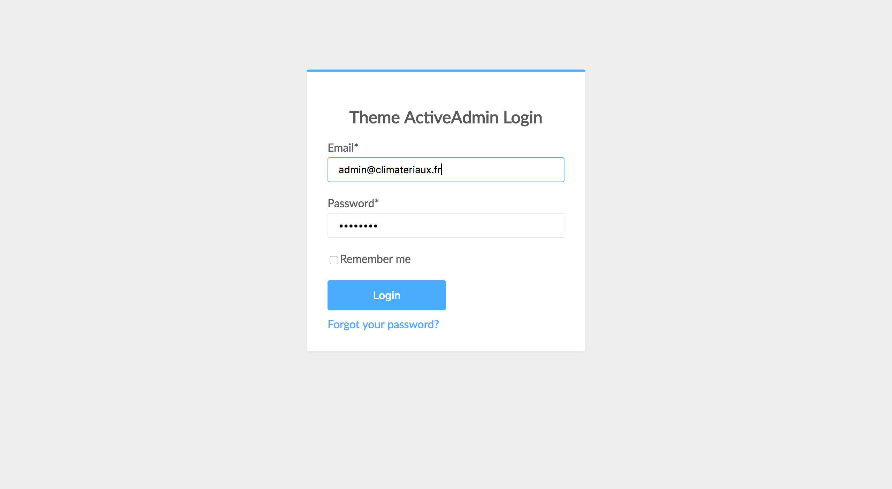
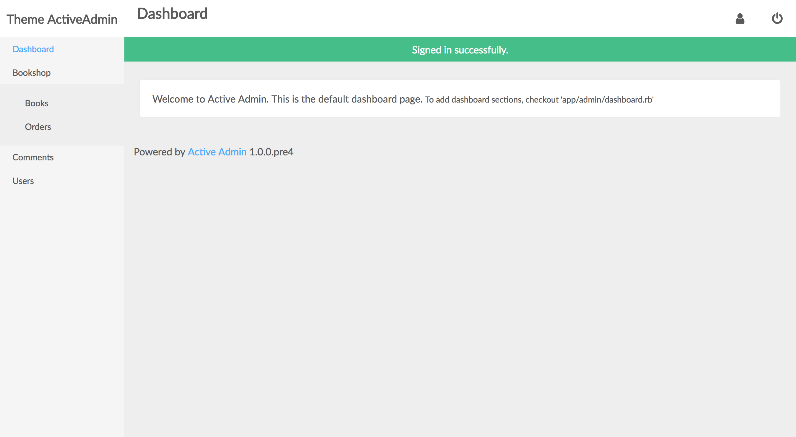
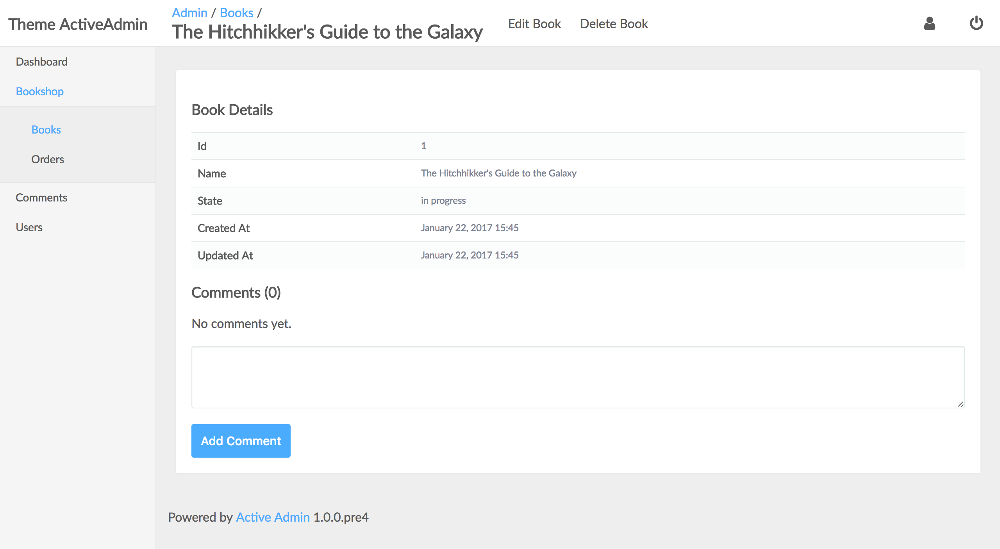

# ArcticAdmin
Simple theme for ActiveAdmin

Complete demo here : https://arctic-admin.herokuapp.com/

admin user : admin@example.com / password

## Installation

add the following lines to your application's Gemfile:
```
gem 'font-awesome-rails'
gem 'arctic_admin'
```

## Screens

<table>
  <tr>
    <td>
      <a href="./doc/login.png"></a>
    </td>
    <td>
      <a href="./doc/dashboard.png"></a>
    </td>
  </tr>
  <tr>
    <td>
      <a href="./doc/index.png"></a>
    </td>
    <td>
      <a href="./doc/show.png"></a>
    </td>
  </tr>
</table>

## Usage

include arctic admin css

```
# active_admin.css.scss

@import "font-awesome";
@import "arctic_admin";
```

include arctic admin js

```
# active_admin.js

//= require jquery
//= require jquery_ujs
//= require active_admin/base
//= require arctic_admin
```

You can even change basic color of the theme by placing some other variables:

```
# active_admin.css.scss

$primary-color: #2dbb43;

@import "arctic_admin";
```

## Contributing

1. Fork it ( https://github.com/cle61/arctic_admin/fork )
2. Create your feature branch (`git checkout -b my-new-feature`)
3. Commit your changes (`git commit -am 'Add some feature'`)
4. Push to the branch (`git push origin my-new-feature`)
5. Create new Pull Request
