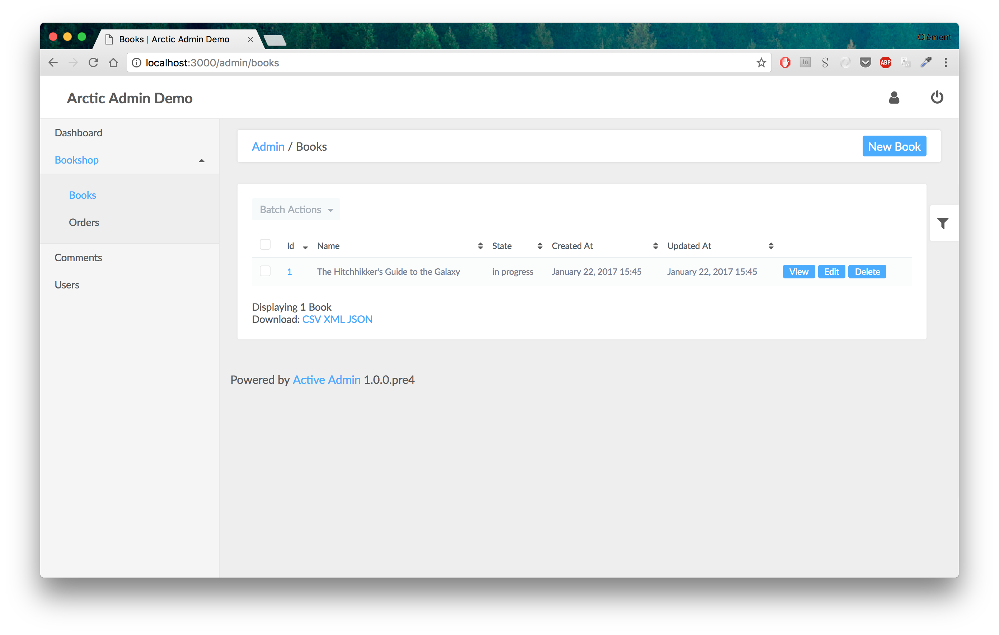

# ArcticAdmin
[](https://rubygems.org/gems/arctic_admin)
[](https://rubygems.org/gems/arctic_admin)
[](https://gemnasium.com/github.com/cprodhomme/arctic_admin)

Simple theme for ActiveAdmin

Complete demo here : https://arctic-admin.herokuapp.com/

admin user : admin@example.com / password



## Installation

- Add this to your Gemfile:

```ruby
gem 'arctic_admin'
```

- Run `bundle install`.

- Add this line to the file `config/initializers/active_admin.rb`

```ruby
meta_tags_options = { viewport: 'width=device-width, initial-scale=1' }
config.meta_tags = meta_tags_options
config.meta_tags_for_logged_out_pages = meta_tags_options
```

## Usage

### CSS

In your `active_admin.css`, include the css file:

```css
/*
 *= require arctic_admin/base
 */
```

**Remove the line `*= require active_admin/base`**

Then restart your webserver if it was previously running.

### Sass Support


If you prefer [SCSS](http://sass-lang.com/documentation/file.SASS_REFERENCE.html), add this to your
`active_admin.css.scss` file:

```scss
@import "arctic_admin/base";
```

If you use the
[Sass indented syntax](http://sass-lang.com/docs/yardoc/file.INDENTED_SYNTAX.html),
add this to your `active_admin.css.sass` file:

```sass
@import arctic_admin/base
```

### JS

In your `active_admin.js`, include the js file:

```js
//= require arctic_admin/base
```

**Remove the line `//= require active_admin/base`**

### Customization

For this, you need to use sass to custom the theme.

You can even change basic color of the theme by placing some other variables:

If you use the [SCSS](http://sass-lang.com/documentation/file.SASS_REFERENCE.html), add this to your
`active_admin.css.scss` file:

```scss
$primary-color: #2dbb43;

@import "arctic_admin/base";
```

If you use the
[Sass indented syntax](http://sass-lang.com/docs/yardoc/file.INDENTED_SYNTAX.html),
add this to your `active_admin.css.sass` file:

```sass
$primary-color: #2dbb43

@import arctic_admin/base
```

Then restart your webserver if it was previously running.

## Contributing

1. Fork it ( https://github.com/cprodhomme/arctic_admin/fork )
2. Create your feature branch (`git checkout -b my-new-feature`)
3. Commit your changes (`git commit -am 'Add some feature'`)
4. Push to the branch (`git push origin my-new-feature`)
5. Create new Pull Request
